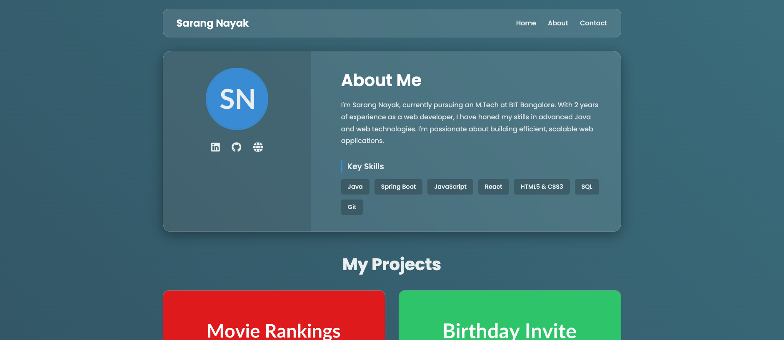

# 🌟 HTML Portfolio

[](LICENSE)  
  
  
  


---

## 🌐 Live Demo  
🔗 [View Project](https://sarangnayak.github.io/html-portfolio/)

---

## 🖼️ Preview  
 

---

## ✨ About  
This project is a **single-page HTML portfolio website**, crafted with a focus on clean design, responsive layout, and showcasing your work and skills.  
It uses vanilla HTML, CSS, and JavaScript for simplicity and ease of deployment.

---

## 🛠️ Features  
- ✅ Responsive layout (Desktop, Tablet, Mobile)  
- ✅ Clean typography and color palette  
- ✅ Smooth scrolling navigation  
- ✅ Sectioned content: Hero, About Me, Skills, Projects, Contact  
- ✅ Lightweight and fast — no heavy libraries  

---

## 📂 Folder Structure  
```
html-portfolio/
│
├── index.html        # Main markup
├── style.css         # Styling, layout, responsive rules
├── script.js         # (Optional) JavaScript for interactivity or scroll effects
└── assets/            # Images, icons, preview screenshot
```
